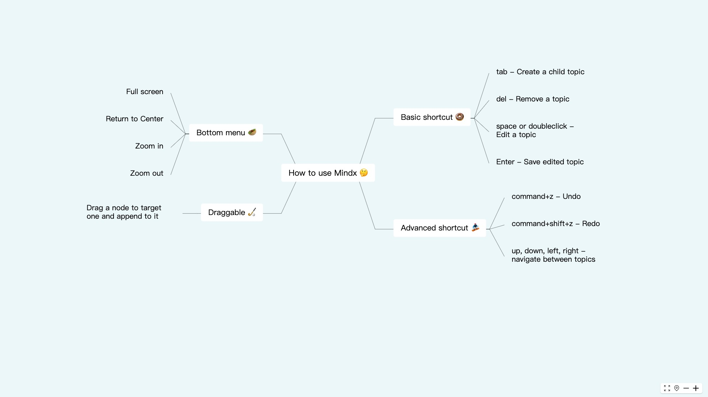

# Mindx

 
 
[](https://sonarcloud.io/dashboard?id=unhandledrejection_mindx) 

Mindx is a free, open source mindmap editor based on React.



Try it on https://mindx.applet.ink

## Status

 * Basic editor feature have been implemented (undo, redo, navigation, drag, CRUD topic, shortcut support)
 * Support basic customization

This project is under active development, check it out at [project panel](https://github.com/unhandledrejection/mindx/projects)

## Installation

```shell
npm i mindx
```

## Quick Start

```JavaScript
import * as React from 'react';
import * as ReactDOM from 'react-dom';
import { Mindmap } from 'mindx';

const App = () => {
  function onChange(root) {
    console.log(root)
  }
  return (
    <div>
      <Mindmap onChange={onChange} />
    </div>
  );
};

ReactDOM.render(<App />, document.getElementById('root'));
```

## API
Mindmap props

| prop     | type                         | description                    | default | optional |
| -------- | ---------------------------- | ------------------------------ | ------- | -------- |
| value    | TopicData                    | control mindmap value          | -       | true     |
| readonly | boolean                      | is mindmap readonly            | false   | true     |
| onChange | (value: TopicData) => void   | listen to mindmap value change | -       | true     |
| locale   | 'en' &#124; 'cn' &#124; 'ja' | language localization          | en      | true     |
| theme    | Theme                        | custom theme                   | -       | true     |

TopicData

```typescript
interface TopicData {
  id: string;
  title: string;
  side?: 'left' | 'right';
  children?: {
      attached: Array<TopicData>;
  };
}
```

Theme

```typescript
interface Theme {
  link: {
    stroke: string;
    strokeWidth: number;
  };
  topic: {
    borderColor: string;
  };
  canvasWidth: number;
  canvasHeight: number;
}
```

## License

[MIT License](https://github.com/unhandledrejection/mindx/blob/master/LICENSE)
