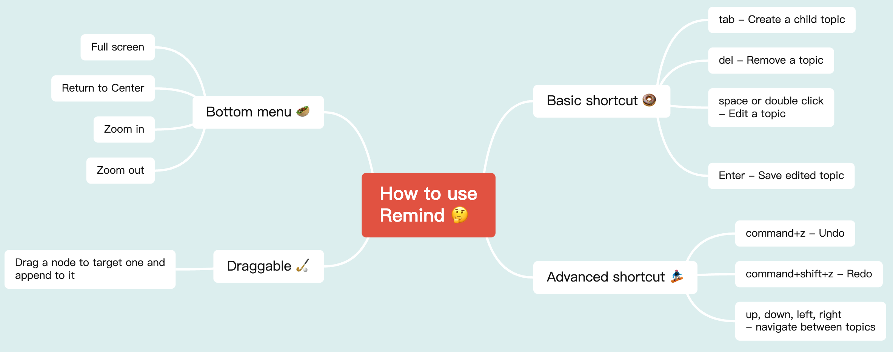

# Remind

[](https://github.com/luvsic3/remind/actions/workflows/main.yml)
[](https://sonarcloud.io/dashboard?id=unhandledrejection_mindx) 

A headless, framework-agnostic and extendable mindmap editor.



- [Try remind](https://remind.applet.ink)
- [Play online](https://stackblitz.com/edit/typescript-nwp9sk?file=index.ts)
- [See roadmap](https://github.com/luvsic3/remind/projects/1)

# Feature

 * Highly extendable, take full control over styling and behavior
 * With default undo, redo, navigation, drag, CRUD, shortcut implementation (but can be replaced)
 * Framework-agnostic, remind can work with vanilla javascript, vue, react or any other framework
 * TypeScript, remind is written in typescript and has great typescript support

# Installation

```shell
npm i remind-core remind-contributions
```

# Quick Start

```JavaScript
import { createMindmap, TopicData } from 'remind-core'
import 'remind-core/dist/style.css'
import { contributions } from 'remind-contributions'

const customData: TopicData = {
  id: '7bf8fd567273',
  title: 'Central Topic',
  children: [
    {
      title: 'main topic 1',
      id: 'f4cb61397246',
    },
    {
      title: 'main topic 2',
      id: 'fa4df6c9708c',
      children: [
        {
          title: 'sub topic 1',
          id: 'f4cb61397241',
        },
      ],
    },
  ],
}

createMindmap(document.querySelector('#app')!, {
  value: customData,
  contributions,
})
```

# API

## Create mindmap

`instance: RefObject<ContributionAPI> = createMindmap(containerNode, options)` 

Render mindmap into containerNode, return an `instance`.

`instance.current` holds `ContributionAPI`, which let you change editor's content, undo redo history, change selected topic... 

see `packages/core/src/interface/contribute.ts` for more.

### options

| option        | type                         | description            | default |
| ------------- | ---------------------------- | ---------------------- | ------- |
| value         | TopicData                    | set mindmap data       | -       |
| onChange      | (value: TopicData) => void   | listen to value change | -       |
| layout        | 'mindmap' &#124; 'structure' | -                      | mindmap |
| locale        | 'en' &#124; 'cn' &#124; 'ja' | language localization  | en      |
| theme         | Theme                        | -                      | -       |
| contributions | Contribution[]               | -                      | []      |

`options.layout` can changed layout algorithm

`options.theme` let you customize mindmap style, see `packages/core/src/interface/theme.ts` for more documentation 

`options.contributions` can extend editor's functionality, custom editor's behavior or add custom render content. see `packages/contributions/src` how to use it.

## Export mindmap as svg/image

See `/packages/core/src/utils/to`, how to use it


## License

[MIT License](https://github.com/luvsic3/remind/blob/master/LICENSE)
